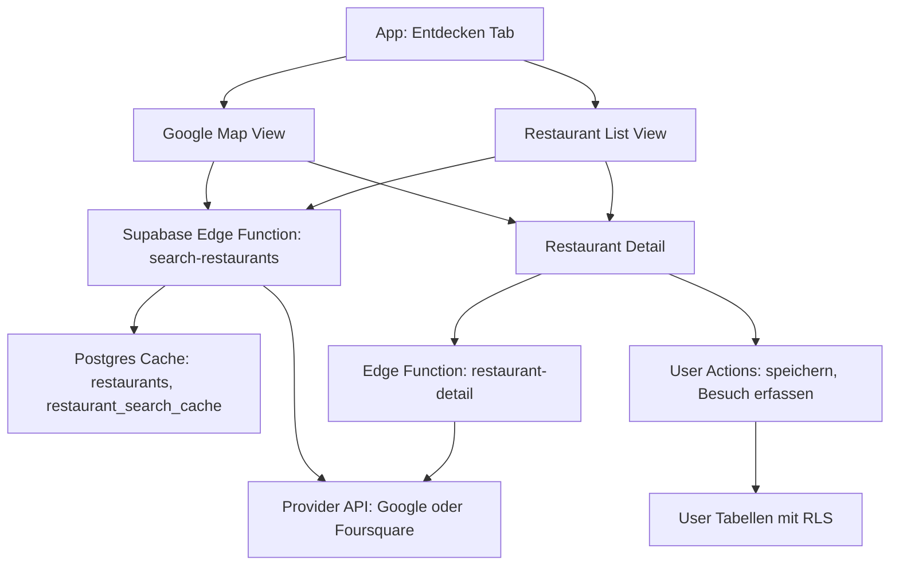

# Restaurant-Discovery: Technische Architektur

Stand: 2026-05-01

## Zielbild

Restaurant-Discovery sollte technisch genauso aufgebaut sein wie die Scan-Pipeline: Mobile App bleibt schlank, externe API-Keys bleiben in Supabase, globale Daten werden gecacht, Userdaten bleiben RLS-geschützt.

Kurzform:



## 1. Datenmodell-Erweiterung

### `restaurants`

Globaler Provider-Cache. Keine Userdaten.

```sql
create table restaurants (
  id uuid primary key default gen_random_uuid(),
  provider text not null,
  provider_place_id text not null,
  name text not null,
  formatted_address text,
  city text,
  country text,
  lat numeric,
  lng numeric,
  rating numeric,
  rating_count int,
  price_level text,
  cuisine_types text[],
  place_types text[],
  phone text,
  website_url text,
  reservation_url text,
  maps_url text,
  photo_refs jsonb default '[]'::jsonb,
  opening_hours jsonb,
  source_payload jsonb,
  last_fetched_at timestamptz not null default now(),
  created_at timestamptz not null default now(),
  updated_at timestamptz not null default now(),
  unique(provider, provider_place_id)
);
```

Wichtig:

- `source_payload` nur speichern, wenn Provider-Bedingungen das erlauben.
- Sonst nur erlaubte Felder cachen.
- `photo_refs` statt Bilder kopieren.

### `restaurant_search_cache`

Schützt API-Kosten bei wiederholten Suchanfragen.

```sql
create table restaurant_search_cache (
  id uuid primary key default gen_random_uuid(),
  provider text not null,
  query_hash text not null,
  lat_bucket numeric,
  lng_bucket numeric,
  city text,
  radius_m int,
  filters jsonb default '{}'::jsonb,
  restaurant_ids uuid[] not null,
  result_count int not null default 0,
  fetched_at timestamptz not null default now(),
  unique(provider, query_hash)
);
```

Bucket-Idee:

- Standort auf grobe Raster runden, z.B. 500 bis 1.000 Meter.
- Gleiche Stadt und gleiche Filter ergeben denselben Cache.
- Nutzerkoordinaten nicht dauerhaft unnötig genau speichern.

### `saved_restaurants`

User merkt sich Restaurants.

```sql
create table saved_restaurants (
  id uuid primary key default gen_random_uuid(),
  user_id uuid not null references auth.users(id) on delete cascade,
  restaurant_id uuid not null references restaurants(id) on delete cascade,
  created_at timestamptz not null default now(),
  unique(user_id, restaurant_id)
);
```

### `restaurant_visits`

Späterer Besuchs- und Erinnerungs-Layer.

```sql
create table restaurant_visits (
  id uuid primary key default gen_random_uuid(),
  user_id uuid not null references auth.users(id) on delete cascade,
  restaurant_id uuid not null references restaurants(id) on delete cascade,
  visited_at date,
  occasion text,
  notes text,
  linked_scan_id uuid references scans(id),
  linked_rating_id uuid references ratings(id),
  created_at timestamptz not null default now()
);
```

### `restaurant_ratings`

Eigene Wine-Scanner-Bewertung, getrennt von Providerbewertungen.

```sql
create table restaurant_ratings (
  id uuid primary key default gen_random_uuid(),
  user_id uuid not null references auth.users(id) on delete cascade,
  restaurant_id uuid not null references restaurants(id) on delete cascade,
  overall_stars int check (overall_stars between 1 and 5),
  food_stars int check (food_stars between 1 and 5),
  wine_stars int check (wine_stars between 1 and 5),
  service_stars int check (service_stars between 1 and 5),
  ambiance_stars int check (ambiance_stars between 1 and 5),
  notes text,
  created_at timestamptz not null default now()
);
```

### RLS-Strategie

| Tabelle | RLS |
| --- | --- |
| `restaurants` | `authenticated` darf SELECT, INSERT/UPDATE nur Edge Function mit Service-Role |
| `restaurant_search_cache` | Kein direkter Mobile-Zugriff, nur Edge Function |
| `saved_restaurants` | User darf nur eigene Zeilen sehen und ändern |
| `restaurant_visits` | User darf nur eigene Zeilen sehen und ändern |
| `restaurant_ratings` | User darf nur eigene Zeilen sehen und ändern |

## 2. API-Integration

### Option A: Direkt vom Mobile Client

Nicht empfohlen.

Warum:

- API-Keys wären im Bundle.
- Keine zentrale Kostenkontrolle.
- Keine saubere Provider-Abstraktion.
- Schwerer zu cachen.

### Option B: Edge Function

Empfohlen.

Neue Functions:

| Function | Aufgabe |
| --- | --- |
| `search-restaurants` | Standort/Stadt plus Filter, Cache prüfen, Provider suchen |
| `restaurant-detail` | Details lazy laden, Cache aktualisieren |
| `save-restaurant` | Restaurant für User merken |
| `delete-saved-restaurant` | Merken entfernen |
| `record-restaurant-visit` | Später: Besuch erfassen |

### Option C: Hybrid

Nicht für MVP. Hybride Providerzugriffe würden die Architektur unnötig unklar machen.

## 3. Provider-Abstraktion

Edge Functions sollten intern eine kleine Provider-Schicht haben:

```ts
type RestaurantProvider = 'google_places' | 'foursquare';

type RestaurantSearchInput = {
  provider: RestaurantProvider;
  query?: string;
  city?: string;
  latitude?: number;
  longitude?: number;
  radiusMeters: number;
  filters: {
    openNow?: boolean;
    minRating?: number;
    priceLevels?: string[];
    cuisine?: string;
  };
};
```

Warum:

- Google kann MVP sein.
- Foursquare kann später verglichen werden.
- UI bleibt gleich.
- Tests können Providerantworten mocken.

## 4. Geo-Location-Pattern

### Permission

Für iOS reicht zunächst "When In Use":

- `NSLocationWhenInUseUsageDescription`
- Deutscher Text: "Wir nutzen deinen Standort, um Restaurants in deiner Nähe zu finden. Du kannst auch eine Stadt manuell eingeben."

### App-Verhalten

| Zustand | UX |
| --- | --- |
| Noch nicht gefragt | Button "Standort verwenden" plus Stadt-Suche |
| Erlaubt | Aktuelle Nähe verwenden |
| Abgelehnt | Kein Druck, Stadt-Suche prominent zeigen |
| Fehler | "Standort konnte nicht bestimmt werden", Stadt-Suche |
| Ungenau | Größeren Radius nutzen und Hinweis zeigen |

### Privacy

Kein permanentes Tracking. Für MVP:

- Aktuelle Koordinate nur für Suche.
- Such-Cache mit gerundeten Buckets.
- Kein historisches Bewegungsprofil.
- Wenn Besuche später Standort speichern, nur Restaurant-ID, nicht Rohbewegung.

### Privacy Manifest

Vor Release muss geprüft werden, ob Apple Location als collected data verlangt. Zusätzlich muss die App Privacy Nutrition in App Store Connect angepasst werden.

## 5. Map-Komponente

### Entscheidung

MVP nutzt `react-native-maps` mit Google Maps Provider.

Warum:

- Gleiche Datenfamilie wie Google Places API.
- Place IDs, Google Maps Links und Kartenansicht passen zusammen.
- Weit verbreitetes Open-Source-Paket.
- Funktioniert im Expo managed workflow über `ios.config.googleMapsApiKey`.
- Weniger komplex und günstiger als Mapbox für diesen Use Case.
- Konsistenter als Apple Maps, wenn Restaurantdaten aus Google Places kommen.

### Expo SDK 54 Setup

Geplante Implementierung, noch keine Code-Änderung in dieser Planungsphase:

```bash
npx expo install react-native-maps
```

`app.config.ts` braucht dann den iOS Google Maps API Key unter `ios.config`:

```ts
ios: {
  config: {
    googleMapsApiKey: process.env.EXPO_PUBLIC_GOOGLE_MAPS_IOS_KEY ?? '',
  },
}
```

In der Map-Komponente:

```tsx
<MapView provider={PROVIDER_GOOGLE} />
```

Wichtig:

- API-Key für die Kartenanzeige darf appseitig vorhanden sein, muss aber auf die iOS Bundle ID `com.francoconsulting.winescanner` beschränkt werden.
- Places API Key für serverseitige Restaurantdaten bleibt in Supabase Secrets.
- Wenn ein gemeinsamer Key genutzt wird, muss er streng eingeschränkt sein. Besser sind getrennte Keys für iOS Maps SDK und serverseitige Places Calls.

### Marker und Clustering

Regeln:

- Bis 20 sichtbare Restaurants: einzelne Marker rendern.
- Ab 20 sichtbaren Restaurants: Clustering aktivieren.
- Cluster zeigt Anzahl und öffnet bei Tap eine gezoomte Ansicht.
- Einzelmarker zeigen bei Tap eine Mini-Info mit Name, Bewertung, Küche und "Details".

Optionen:

| Ansatz | Empfehlung |
| --- | --- |
| `react-native-map-clustering` | Erst prüfen, wenn kompatibel mit SDK 54 und New Architecture |
| Eigene Grid-Cluster-Logik | Fallback, wenn Library Probleme macht |
| Kein Clustering | Nur für Testdaten, nicht für MVP |

### Map-Performance

MVP-Regeln:

- Nur Marker im sichtbaren Viewport rendern.
- Keine Re-Fetches bei jedem Pan.
- 500 ms Debounce nach letzter Map-Bewegung.
- Bounding-Box-basierter Restaurant-Query.
- Viewport-Cache für 5 Minuten.
- Maximal 50 Restaurants initial anzeigen.
- Bilder nicht in Markern laden, nur in Mini-Info und Liste.
- Cluster-Animation auf iPhone 12 und neuer flüssig testen.

### Default-View

Empfehlung:

- Nach Standortfreigabe: Karte zuerst.
- Nach Stadt-Suche: Karte zuerst, zentriert auf Stadt.
- Ohne Standort/Stadt: Such-Startscreen, danach Karte.
- Toggle `Karte` und `Liste` prominent oben.

## 6. Caching-Strategie

| Datentyp | Cache-Dauer | Grund |
| --- | ---: | --- |
| Restaurant-Stammdaten | 30 Tage | Name/Adresse ändern selten |
| Bewertung und Rating Count | 7 Tage | Nutzer erwarten halbwegs aktuelle Qualität |
| Öffnungszeiten | 7 Tage | Kann sich ändern, aber nicht minütlich |
| "Jetzt offen" | Lokal berechnen oder frisch auf Detail | Muss für Entscheidung stimmen |
| Fotos | Referenzen 30 Tage, Bild selbst nicht kopieren | Provider-Rechte beachten |
| Suchergebnisse | 24 Stunden bis 7 Tage | Abhängig von Provider-Terms und Kosten |

### Kostenkontrolle

- Tageslimit pro Provider.
- Monatsbudget pro Provider.
- Feature Flag zum Abschalten.
- Cache-Hit-Rate messen.
- Providerfehler und 429 in Sentry tracken.

## 7. Performance-Anforderungen

| Ziel | Wert |
| --- | ---: |
| Cached Search | unter 500 ms |
| Cold Search | unter 2,5 s |
| Detail aus Cache | unter 300 ms |
| Detail cold | unter 1,5 s |
| Liste | 20 Ergebnisse initial |
| Map | maximal 50 sichtbare Marker vor Pagination/Cluster |
| Map Pan Debounce | 500 ms |
| Cluster Threshold | ab 20 sichtbaren Markern |
| Map Initial Zoom | 12 |
| Image Loading | progressive, cached |

## 8. UI-Architektur

Vorgeschlagene Komponenten:

```text
src/components/restaurants/
  RestaurantSearchBar.tsx
  RestaurantFilterChips.tsx
  RestaurantCard.tsx
  RestaurantMap.tsx
  RestaurantMarker.tsx
  RestaurantClusterMarker.tsx
  RestaurantMapCallout.tsx
  RestaurantViewToggle.tsx
  RestaurantHero.tsx
  RestaurantMetaRow.tsx
  RestaurantOpenBadge.tsx
  RestaurantSourceBadge.tsx
  SavedRestaurantButton.tsx
```

Hooks:

```text
src/hooks/useRestaurantSearch.ts
src/hooks/useRestaurantDetail.ts
src/hooks/useSavedRestaurants.ts
src/hooks/useLocationPermission.ts
src/hooks/useRestaurantMapRegion.ts
```

Lib:

```text
src/lib/restaurants.ts
src/lib/location.ts
```

## 9. Teststrategie

Automatisiert:

- `test:restaurant-search-cache`.
- `test:restaurant-detail-cache`.
- `test:restaurant-rls`.
- Provider-Response-Mapping mit Fixtures.
- Location denied fallback.

Manuell:

- Standort erlaubt.
- Standort verweigert.
- Stadt-Suche.
- Karte pan/zoom ohne Fetch-Spam.
- Marker-Tap öffnet Mini-Info.
- Mini-Info öffnet Detail.
- Clustering ab 20 sichtbaren Markern.
- Provider down.
- API limit erreicht.
- Dark Mode.
- Kleine iPhones.

## Quellen

- [Expo Location](https://docs.expo.dev/versions/v54.0.0/sdk/location)
- [Expo Permissions](https://docs.expo.dev/guides/permissions/)
- [react-native-maps Expo Docs](https://docs.expo.dev/versions/latest/sdk/map-view/)
- [Google Maps Platform Pricing](https://developers.google.com/maps/billing-and-pricing/pricing)
- [Maps SDK for iOS Usage and Billing](https://developers.google.com/maps/documentation/ios-sdk/usage-and-billing)
- [Expo Maps](https://docs.expo.dev/versions/latest/sdk/maps/)
- [Apple CoreLocation Permission](https://developer.apple.com/documentation/corelocation/cllocationmanager/requestwheninuseauthorization%28%29)
- [Apple MKLocalSearch](https://developer.apple.com/documentation/mapkit/mklocalsearch)
- [Mapbox Pricing](https://www.mapbox.com/pricing)
